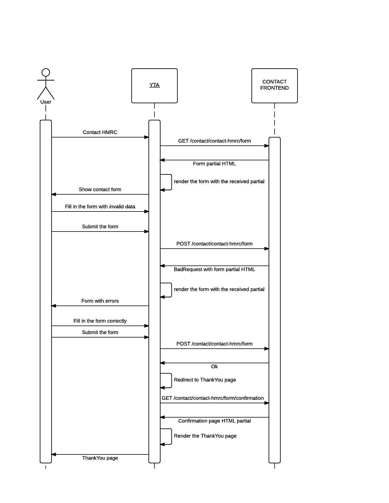

contact-frontend
================

This application provides connectivity to Deskpro ticketing system. It provides views for:
 - reporting problems with a page
 - contacting HMRC
 - providing BETA feedback

Partial HTML providers
----------------------

These are the URLs to retrieve and submit the forms. The idea is to have the form and confirmation page (and the related controller) in your own app (using your base template, incl. header, side bars, etc.) and suck in the form part from contact-frontend. Here is a simple sequence how it works.

`GET /contact-hmrc/form?submitUrl=<url_of_your_contact_form>&csrfToken=<csrf_token>`

`POST /contact-hmrc/form?resubmitUrl=<url_of_your_contact_form>`

`GET /contact-hmrc/form/confirmation?ticketId=<deskpro_ticket_id>`

`GET /beta-feedback/form?submitUrl=<url_of_your_feedback_form>&csrfToken=<csrf_token>`

`POST /beta-feedback/form?resubmitUrl=<url_of_your_feedback_form>`

`GET /beta-feedback/form/confirmation?ticketId=<deskpro_ticket_id>`

`GET /problem_reports?secure=true&csrfToken=<csrf_token>`

`POST /problem_reports_secure`

An example client controller is in [YTA](https://github.tools.tax.service.gov.uk/HMRC/business-tax-account/blob/master/app/controllers/ContactHmrcController.scala).

Vanila screens (now deprecated)
-------------------------------

This still provides endpoints to complete vanilla screens, incl. empty header and wrapped with GovernmentGateway authorisation code. It is recommended to use partials and provide headers / authorisation in your controllers.

Running Tests
-------------------------------
sbt clean test fun:test

