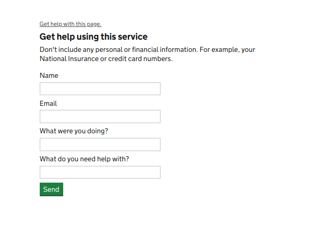
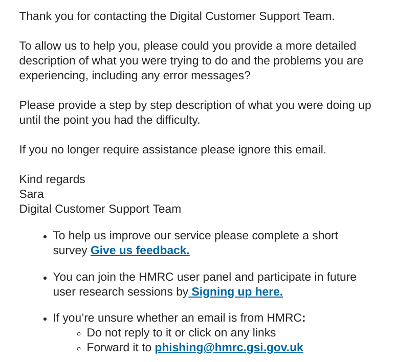
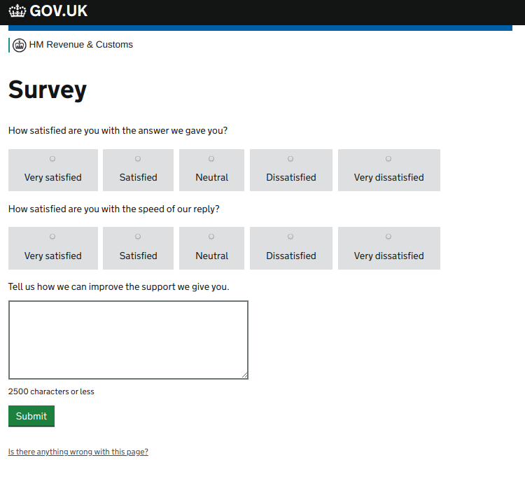
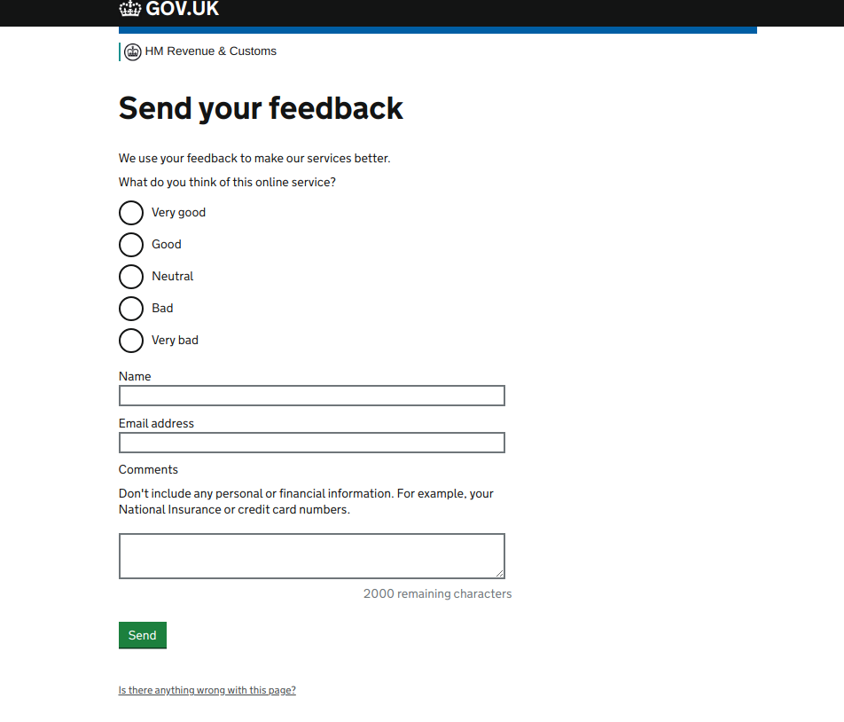
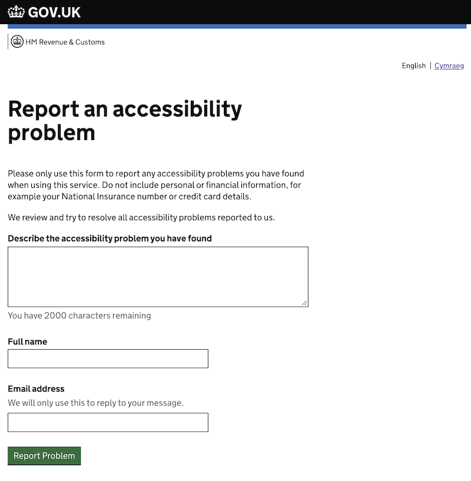

contact-frontend
================

This service allows users to contact the HMRC Customer Contact team for 3 major purposes:
1) report problems and ask questions ('Get help with this page')
2) provide feedback about the service ('Help and contact' & 'Providing Beta feedback about services')
3) provide feedback about how well an issue was resolved by the HMRC Customer Contact team ('Customer Satisfaction')

Contact-frontend is responsible for showing forms pertaining to the purposes listed above, validating the input, and
passing user requests to downstream services - to [Deskpro](https://confluence.tools.tax.service.gov.uk/x/4oadBg) for 'Get help with this page', 'Help and contact' and 'Providing Beta feedback about services', and Splunk datastore for 'Customer Satisfaction'. Although Splunk is currently used to store such responses, these are intended to be migrated to a more suitable datastore at a later date.

The service is not intended to be used standalone; rather to be integrated with other services.

# Contents
   * [Forms provided by the Customer Contact Subsystem](#forms-provided-by-the-customer-contact-subsystem)
      * [Contacting HMRC - <em>Get help with this page</em>](#contacting-hmrc---get-help-with-this-page)
      * [Contacting HMRC - <em>Help and contact</em>](#contacting-hmrc---help-and-contact)
      * [Providing feedback about Digital Customer Support Team](#providing-feedback-about-digital-customer-support-team)
      * [Providing Beta feedback about services](#providing-beta-feedback-about-services)
      * [Report an accessibility problem](#report-an-accessibility-problem) 
   * [Integration guide](#integration-guide)
      * [Cross-Origin Resource Sharing (CORS)](#cross-origin-resource-sharing-cors)
      * [Creating own customer contact forms](#creating-own-customer-contact-forms)
   * [Other relevant details](#other-relevant-details)
      * [User details attached to the ticket](#user-details-attached-to-the-ticket)
      * [Location of Javascript code used by the service](#location-of-javascript-code-used-by-the-service)
      * [Related projects, useful links](#appendix__linx)
      * [Slack](#appendix__links__slack)


# Forms provided by the Customer Contact Subsystem <a name="forms-provided-by-the-customer-contact-subsystem"></a>

## Contacting HMRC - *Get help with this page* <a name="contacting-hmrc---get-help-with-this-page"></a>


This form should be used as the standard way to allow users to report problems and ask questions about the relevant service in which this form is visualised.

Here is a screenshot of the form:



This contact form consists of the following fields:
- the user's name
- the user's email address
- the action performed by the user
- the error seen by the user

Requests of this type are forwarded to *Deskpro* with the subject *"Support Request"*. 
The contents of the *action* and *error* fields are concatenated and stored in the ticket body.

UI components allowing implementation of the form are provided by the [play-ui](https://github.com/hmrc/play-ui) library.
Play UI library contains a Twirl template that allows you to render the "Get help with this page" link in the footer
of a standard HMRC page, provided that you use the *hmrcGovUkTemplate* template. In order to use it, you must add the following lines into the relevant file using the *hmrcGovUkTemplate*:

1) Define the 'get help form component'
```
@getHelpForm = @{
  uiHelpers.reportAProblemLink(
    /contact/problem_reports_ajax?service=<your-service-name-here>,
    /contact/problem_reports_nonjs?service=<your-service-name-here>
  )
} 
```

2) Use it when instantiating the *hmrcGovUkTemplate*

```
@content = {
  @uiLayouts.main_content(
    article = ...,
    mainClass = ...,
    mainDataAttributes = ...,
    mainContentHeader = ...,
    serviceInfo = ...,
    getHelpForm = getHelpForm,
    sidebar = ...
  )
}
```

[[Back to the top]](#top)

## Contacting HMRC - *Help and contact* <a name="contacting-hmrc---help-and-contact"></a>

This form is very similar to the *Get help with this page* form.
There are minor differences in how this form works in comparison to 'Get help with this page'.

This contact form contains only three input fields:
- name
- email address
- comments

Requests of this type are forwarded to *Deskpro* with the subject *"Contact form submission"*

This functionality can be implemented by consuming services in two modes:
* as a standalone form
* as a form included in the underlying page, retrieved by a partial

If you want to use the standalone version of the form, you have to redirect the user to one of the following URLs:
* if the user is unauthenticated - `https://www.{environment}.tax.service.gov.uk/contact/contact-hmrc-unauthenticated?service=${serviceId}`
* if the user is authenticated - `https://www.{environment}.tax.service.gov.uk/contact/contact-hmrc?service=${serviceId}`

'{environment}.' is not included in the case of the production environment.

### Cross-domain linking

For cross-domain linking situations, an optional querystring parameter, referrerUrl, can also be supplied to the unauthenticated 
standalone page. This parameter should contain the full, absolute, properly encoded URL of the page the user was on before they navigated to
the contact form. For example, a link from the SCP sign in page would look like 
`https://www.tax.service.gov.uk/contact/contact-hmrc-unauthenticated?service=scp&referrerUrl=https%3A%2F%2Fwww.access.service.gov.uk%2Flogin%2Fsignin%2Fcreds`

The referrer field is passed to the DeskPro service and lets operators know which page the user was on when they asked to
contact HMRC. If the referrerUrl is not supplied, the application will attempt to use the HTTP Header and userAction parameter (if present). 
However, this mechanism is not recommended because it relies on browsers correctly forwarding the HTTP Referer header in all situations.

`Help and contact` historically also supported displaying the *Help and contact* page as a partial; however, this
functionality is *deprecated* and should not be used.

[[Back to the top]](#top)

## Providing feedback about the Digital Customer Support Team ('Customer Satisfaction') <a name="providing-feedback-about-digital-customer-support-team"></a>
Upon resolving a customer issue, response emails are sent by the Digital Customer Support Team containing a link inviting users to complete a survey about the customer's satisfaction with the way their issue was handled, this survey being provided by contact-frontend. Data from the survey are then stored in Deskpro.

Here is an example of the email received by the user:


This is how the DCST feedback form looks:



Feedback survey results currently are stored in Splunk as explicit audit events with the following properties:
* *auditSource* - "frontend"
* *auditType* - "DeskproSurvey"
* *details* 
    * *helpful* - the respose to the question about user satisfaction
    * *speed* - the response about satisfaction with the speed of DCST reply
    * *improve* - contents of the textual field with improvement suggestions
    * *ticketId* - the reference of the case (same as in email)
    * *serviceId* - an identifier of the service - same as provided in the *Get help with this page* page

This functionality is used by Deskpro and shouldn't be used by any consuming service directly.
Emails received from Deskpro should contain link in the following format:

`https://www.{environment}.tax.service.gov.uk/contact/survey?ticketId={deskproTicketKey}&serviceId={serviceId}`

'{environment}.' is not included in the case of the production environment.

This link then redirects the user to the standalone page where the survey can be filled in.

[[Back to the top]](#top)

## Providing Beta feedback about services <a name="providing-beta-feedback-about-services"></a>



This form consists of the following fields:
- service rating (radio button group with 5 values)
- user's name
- user's email address
- additional comments (optional)

Feedback responses are forwarded to Deskpro with the subject *"Beta feedback submission"*

This functionality can be implemented by consuming services in two modes:
* as a form displayed within a separate, standalone page
* as a form included in the underlying page, retrieved by a partial and initially hidden

If you want to display this form as a standalone page, you should render such a link on your page:
* if the user is unauthenticated - `https://www.{environment}.tax.service.gov.uk/contact/beta-feedback-unauthenticated?service=${serviceId}&additional parameters`
* if the user is authenticated - `https://www.{environment}.tax.service.gov.uk/contact/beta-feedback?service=${serviceId}&additional parameters`

'{environment}.' is not included in the case of the production environment.

Customization flags:
* *service* - consuming services should specify their identifier as the 'service' parameter of requests to contact-frontend. The value of this parameter will be later passed to Splunk and will allow you to properly analyze feedback
* *canOmitComments* - consuming services can decide whether the 'comments' field is optional. To make this the case, the consuming service must add 'canOmitComments=true' field to the request
* *backURL* - (only for standalone page mode). A 'Back' button redirecting the user back to the consuming service can be embedded into the Beta Feedback form. In order to achieve this, the consuming service has to specify a destination URL.

If you want to embed the feedback form on your page, you have to create endpoints in your frontend service that redirect user requests to contact-frontend and wrap HTML code around the returned in a response in your services layout. Three requests need to be handled:

a) GET endpoint to show the form. This should result in making a backend GET call to the endpoint 
`https://contact-frontend.public.mdtp/contact/beta-feedback/form?{params}`, where params should consist of:
 * *submitUrl* - url that should be used by the user to make a POST request to submit the form. This should be set to the value of the POST endpoint implemented in b).
 * *service* - consuming services should specify their identifier as the 'service' parameter of requests to contact-frontend. The value of this parameter will later be passed to Splunk and would allow proper analysis of feedback
 * *canOmitComments* - consuming services can decide whether the 'comments' field is optional. To make it optional, the consuming service must add 'canOmitComments=true' field to the request
 * *csrfToken* - CSRF token generated from cookies of the consuming service. This parameter will be added automatically by the [play-partials](https://github.com/hmrc/play-partials) library and the service itself should't add it manually.
 * *referrerUrl* - the full, absolute URL of the page the user is submitting feedback about.
This endpoint will return a HTML partial than can then be embedded in the page layout.

b) POST endpoint to submit the form. This should result in making a backend POST call to the endpoint
`https://contact-frontend.public.mdtp/contact/beta-feedback/form?resubmitUrl`, where the *resubmitUrl* is a public facing URL to this endpoint

In the case where form submission succeeds, this endpoint will return a HTTP 200 response containing the identifier of the ticket that has been created. In this case, the consuming service should redirect the user to the endpoint that displays the confirmation page (described below).

In the case where form submission fails, this endpoint will return a HTTP 400 response with a body of a HTML snippet containing the form with errors higlighted.
This snippet must be displayed again back to the user.

c) GET endpoint to display confirmation of the successful submission. This should result in making a GET call to the endpoint `https://contact-frontend.public.mdtp/contact/beta-feedback-confirmation`, which will then return HTML partial
with a confirmation message decorated with the layout of the consuming service.

Handling of partials can be simplified by using [play-partials](https://github.com/hmrc/play-partials) library.

A good example of how to integrate the feedback form with the service can be found in this repository: [business-rates-valuation-frontend](https://github.com/hmrc/business-rates-valuation-frontend)

[[Back to the top]](#top)

## Report an Accessibility Problem <a name="report-an-accessibility-problem"></a>



This form consists of the following fields:
- Description of accessibility problem
- user's name
- user's email address

Accessibility problems are forwards to Deskpro with the subject *"Accessibility Problem"*.

This functionality is presently only implemented as a standalone page.

To display the standalone page, create a link from your accessibility statement page:
* if the user is unauthenticated - `https://www.{environment}.tax.service.gov.uk/contact/accessibility-unauthenticated?service=${serviceId}&userAction=${useraction}`
* if the user is authenticated - `https://www.{environment}.tax.service.gov.uk/contact/accessility?service=${serviceId}&userAction=${useraction}`

`{environment}` is not included in the case of the production environment.

URL parameters:
* *service* - consuming services should specify their identifier as the 'service' parameter of requests to contact-frontend. The value of this parameter will be later passed to Splunk and will allow you to properly analyze feedback
* *userAction* - path of page the user reported in accessibility problem on. Since they arrive at the form from the accessibility statement page, we cannot rely on the referrer header to track this, so we use this field to store the this value

The form is intended to be displayed in a new tab or window. When the form is completed they are redirected to a confirmation page and prompted to close the tab or window.

[[Back to the top]](#top)

# Integration guide <a name="integration-guide"></a>

Below, you can find a brief description of how to use forms provided by contact-frontend in your service.

A detailed integration guide can be found on [Confluence](https://confluence.tools.tax.service.gov.uk/display/PlatDev/Customer+Contact+Services%3A+Integration+Guide).

[[Back to the top]](#top)


## Cross-Origin Resource Sharing (CORS) <a name="cross-origin-resource-sharing-cors"></a>

When contact forms are embedded on a service's pages, the client's browser communicates with contact-frontend using AJAX requests.
This may cause problems when the service runs on a different domain from the one used by contact-frontend (which is `www.tax.service.gov.uk`). In such a case, the user's browser will block cross-domain AJAX requests, considering them suspicous.

If you want to use contact-frontend in a service that runs on another domain, this can be done by explicitly specifying that other domain in the configuration of contact-frontend. Contact-frontend service will then use [CORS](https://developer.mozilla.org/en-US/docs/Web/HTTP/CORS) (Cross-Origin Resource Sharing) to allow the browser to accept such cross-domain requests.

To achieve that, the service uses the standard  [CORS Filter](https://www.playframework.com/documentation/2.5.x/CorsFilter) provided by Play Framework.
Configuration is defined in `contact-frontend.yaml` within the environment specific `app-config`. Here is example configuration:
```
play.filters.cors.allowedOrigins.0: "https://ewf.companieshouse.gov.uk"
play.filters.cors.allowedOrigins.1: "https://www.qa.tax.service.gov.uk"
```

[[Back to the top]](#top)

## Creating customized customer contact forms <a name="creating-own-customer-contact-forms"></a>

Currently it's not possible to customize forms in ways other than described above. If you have business
requirements to customize customer contact form, please get in touch with PlatOps team ([#team-platops](https://hmrcdigital.slack.com/messages/C0GS60DK2))

[[Back to the top]](#top)

# Other relevant information <a name="other-relevant-details"></a>

## User details attached to the ticket <a name="user-details-attached-to-the-ticket"></a>

In addition to the information provided by the user, the service collects the following context data:
* *HTTP Referrer header* - this should be the same as the URL of the page on which the user initiated the contact journey. Deskpro uses it to classify issues.
* *HTTP UserAgent header* - this tells us what browser the user has
* *user tax identifiers* - if the user his logged in, user tax identifiers will be attached to the tickets. These identifiers can later be seen in Deskpro
* *whether user's browser uses Javascript* 
* *user's id* - as provided in the HeaderCarrier object
* *sessionId* - as provided in the HeaderCarrier object
 
Here is a list of supported identifiers:

* NIN
* UTR
* VAT registration number
* PAYE reference

[[Back to the top]](#top)

## Location of Javascript code used by the service <a name="location-of-javascript-code-used-by-the-service"></a>

Part of the logic of contact-frontend (mainly related to reporting a problem) is performed by javascript code located in the [assets-frontend](https://github.com/hmrc/assets-frontend/blob/master/assets/javascripts/modules/reportAProblem.js) project.

When making changes in the asset-frontend service, be aware that it may take long time for these changes to be adopted by service maintainers.

[[Back to the top]](#top)

## Related projects, useful links: <a name="appendix__linx"></a>

* [hmrc-deskpro](https://github.com/hmrc/hmrc-deskpro/) - Backend service responsible for forwarding requests from contact-frontend to Deskpro
* [contact-acceptance-tests](https://github.com/hmrc/contact-acceptance-tests/) - Acceptance tests of the CCS subsystem
* [deskpro-performance-tests](https://github.com/hmrc/deskPro-performance-tests) - Performance tests of the CCS subsystem combined with performance tests of the DeskPro agent journey
* [deskpro-mods](https://github.com/hmrc/deskpro-mods) - Modifications of Deskpro that add a button allowing the Support Team to lookup for tax identifier of a request sender 

## Slack <a name="appendix__links__slack"></a>
* [#team-platops](https://hmrcdigital.slack.com/messages/C0GS60DK2) - PlatOps is responsible for contact-frontend
* [#team-ddcops](https://hmrcdigital.slack.com/messages/C0HUAN03S) - DDCOps is responsible for Deskpro maintenance

[[Back to the top]](#top)
