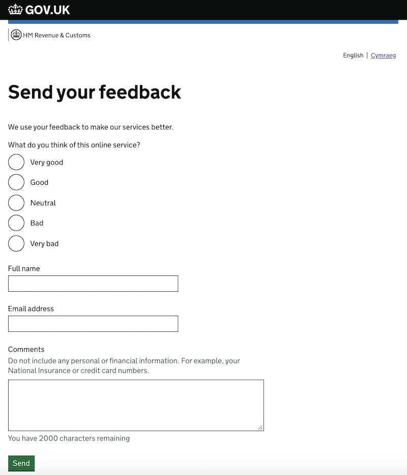

# contact-frontend

## Overview
This service provides forms that enable users to contact HMRC for five distinct reasons:
1. reporting a technical problem ('Is this page not working properly?')
1. providing feedback on a beta service ('Send your feedback')
1. getting help with their tax account ('Help and contact')
1. providing post-support feedback to the HMRC Digital Technical Support Team ('Survey')
1. reporting an accessibility problem with a service ('Report an accessibility problem')

`contact-frontend` will validate the user's input (for example, to ensure that email addresses are valid),
and pass user requests to the relevant downstream service - to Deskpro for 'Is this page not working properly?',
'Help and contact', 'Send your feedback' and 'Report an accessibility problem',
and to an internal auditing service for 'Survey' (contact
[#team-platui](https://hmrcdigital.slack.com/messages/team-plat-ui/)
if you require more information about this).

## Contents
  * [Integration guide](#integration-guide)
    * [Frontend services](#frontend-services)
    * [Other services](#other-services)
    * [User details attached to submitted ticket](#user-details-attached-to-submitted-tickets)
  * [Further information](#further-information)
    * [Getting help](#getting-help)
    * [Maintenance documentation](#maintenance-documentation)
  * [Appendix - example forms](#appendix---example-forms)
     * [Contacting HMRC - <em>Is this page not working properly?</em>](#contacting-hmrc---is-this-page-not-working-properly)
     * [Providing Beta feedback about services](#providing-beta-feedback-about-services)
     * [Contacting HMRC - <em>Help and contact</em>](#contacting-hmrc---help-and-contact)
     * [Providing feedback about the Digital Technical Support Team](#providing-feedback-about-the-digital-technical-support-team-customer-satisfaction)
     * [Reporting an accessibility problem](#reporting-an-accessibility-problem) 

## Integration guide

### Frontend services
Frontend services built using play-frontend-hmrc will typically integrate with contact-frontend in one or two pre-defined ways.
If these don't meet your specific needs, please contact the PlatUI team via [#team-plat-ui](https://hmrcdigital.slack.com/messages/team-plat-ui/) to discuss.

#### Enabling users to report technical issues with the service
You should use the
[HmrcReportTechnicalIssueHelper](https://github.com/hmrc/play-frontend-hmrc?tab=readme-ov-file#helping-users-report-technical-issues)
to add a link to your service's main layout template, to enable users to report technical issues from any page in the service.

For an example of the resulting form, please see the [Appendix](#contacting-hmrc---is-this-page-not-working-properly).

#### Enabling users to provide feedback on a service in beta
When your new service is in beta, you should use the
[Beta Feedback banner](https://github.com/hmrc/play-frontend-hmrc?tab=readme-ov-file#adding-a-beta-feedback-banner)
to add a banner that tells the user the service is in beta, and includes a link for them to provide feedback.

For an example of the resulting form, please see the [Appendix](#providing-beta-feedback-about-services).

### Other services
Services that don't have a frontend (eg. mobile or API services) should instead integrate directly with the
[deskpro-ticket-queue](https://github.com/hmrc/deskpro-ticket-queue) API.

### User details attached to submitted tickets
In addition to the information provided by the user, the service collects the following context data:
* **Referrer** - this is the URL of the page on which the user initiated the contact journey, as passed on the
  URL as a query string parameter. Deskpro uses it to classify issues. In the absence of a `referrerURL` parameter,
  the value will be taken from the HTTP `Referer` header.
* **HTTP UserAgent header** - this tells us what browser the user is using.
* **Javascript?** - whether the user's browser has Javascript enabled
* **authId** - as provided in the HeaderCarrier object
* **sessionId** - as provided in the HeaderCarrier object
* **User tax identifiers** - if the user is signed-in, any related tax identifiers will be attached to the tickets.
  These are stored in `deskpro-ticket-queue` and can later be viewed from Deskpro.  They can include, but are not limited to:
    * National Insurance Number (NINO)
    * Unique Taxpayer Reference (UTR)
    * VAT registration number
    * PAYE reference

[[Back to the top]](#top)

## Further information

### Getting help
* [#team-platui](https://hmrcdigital.slack.com/messages/team-plat-ui/) - PlatUI is responsible for contact-frontend
  
  (Slack is our preferred method of contact, but you can also reach us by email via platform-ui@digital.hmrc.gov.uk)
* [#team-ddcops](https://hmrcdigital.slack.com/messages/team-ddcops) - DDCOps is responsible for Deskpro

### Maintenance documentation
Maintenance documentation for the owning team, including architectural decision records (ADRs) can be found [here](docs/maintainers.md).

[[Back to the top]](#top)

## Appendix - Example forms

### Contacting HMRC - *Is this page not working properly?*

This form provides the primary way for users to report technical issues with tax services. Here is a screenshot of the form:

This contact form consists of the following fields:
- the user's name
- the user's email address
- the action performed by the user
- the error seen by the user

Form submissions are forwarded to *Deskpro* with the subject *"Support Request"*. 
The contents of the *action* and *error* fields are concatenated and stored in the ticket body.

To link to this form, it is recommended that services follow the integration steps detailed in
[play-frontend-hmrc](https://github.com/hmrc/play-frontend-hmrc#helping-users-report-technical-issues). By using the
`play-frontend-hmrc` helper, the required query string parameters `service` and `referrerUrl` will be bound correctly to 
the link. 

The format for the link should be rendered as follows:
* `https://www.{environment}.tax.service.gov.uk/contact/report-technical-problem?service=${serviceId}&referrerUrl=${urlOfPageContainingLink}`

| URL parameter  | Description                                                                                                          |
| ---------------| -------------------------------------------------------------------------------------------------------------------- |
| `service`      | an identifier for your service unlikely to be used by any other service, excluding whitespace and special characters |
| `referrerUrl`  | the full, absolute, properly encoded URL of the page the user was on before they navigated to the contact form       |

[[Back to the top]](#top)

## Providing Beta feedback about services

This form consists of the following fields:
- service rating (radio button group with 5 values)
- user's name
- user's email address
- additional comments (optional)

Feedback responses are forwarded to Deskpro with the subject *"Beta feedback submission"*

To use this form, render a link on your page to:
* `https://www.{environment}.tax.service.gov.uk/contact/beta-feedback?service=${serviceId}&additional parameters`

'{environment}.' is not included in the case of the production environment.

| URL parameter     | Description                                                                                                          |
| ------------------| -------------------------------------------------------------------------------------------------------------------- |
| `service`         | an identifier for your service unlikely to be used by any other service, excluding whitespace and special characters |
| `canOmitComments` | consuming services can decide whether the 'comments' field is optional. To make this the case, the consuming service must add 'canOmitComments=true' field to the request |
| `backUrl`         | an optional 'Back' button redirecting the user back to the consuming service can be embedded into the Beta Feedback form. In order to achieve this, the consuming service has to specify a destination URL |
| `referrerUrl`     | the full, absolute, properly encoded URL of the page the user was on before they navigated to the contact form. For example, a link from the SCP sign in page would look like `https://www.tax.service.gov.uk/contact/beta-feedback?service=scp&referrerUrl=https%3A%2F%2Fwww.access.service.gov.uk%2Flogin%2Fsignin%2Fcreds` |

[[Back to the top]](#top)

### Contacting HMRC - *Help and contact*
> :warning: This form is deprecated, as experience has shown that it is used to report things that DTST can't help with,
> for example forgotten login credentials.

This form is very similar to the *Is this page not working properly?* form, with the following differences:

This contact form contains only three input fields:
- name
- email address
- comments

Requests of this type are forwarded to *Deskpro* with the subject *"Contact form submission"*

[[Back to the top]](#top)

## Providing feedback about the Digital Technical Support Team ('Customer Satisfaction')
> :warning: This functionality is used by Deskpro and is not to be used by any consuming service directly.

Upon resolving a customer issue, response emails are sent by the Digital Technical Support Team containing a link 
inviting users to complete a survey about the customer's satisfaction with the way their issue was handled.

Here is an example of the email received by the user:

Emails received from Deskpro by tax users will contain link in the following format:

`https://www.{environment}.tax.service.gov.uk/contact/survey?ticketId={deskproTicketKey}&serviceId={serviceId}`

'{environment}.' is not included in the case of the production environment.

This link then takes the user to the survey page, which looks like this:

Feedback survey results currently are stored as explicit audit events with the following properties:
* *auditSource* - "frontend"
* *auditType* - "DeskproSurvey"
* *details* 
    * *helpful* - the response to the question about user satisfaction
    * *speed* - the response about satisfaction with the speed of DTST's reply
    * *improve* - contents of the textual field with improvement suggestions
    * *ticketId* - the reference of the case (same as in email)
    * *serviceId* - an identifier of the service - same as provided in the *Is this page not working properly?* page

[[Back to the top]](#top)

## Reporting an accessibility problem

> :warning: This form is linked to from [accessibility-statement-frontend](https://www.github.com/hmrc/accessibility-statement-frontend)
> and is not to be used directly.

This form consists of the following fields:
- Description of accessibility problem
- user's name
- user's email address

Accessibility problems are forwarded to Deskpro with the subject *"Accessibility Problem"*.

[[Back to the top]](#top)
