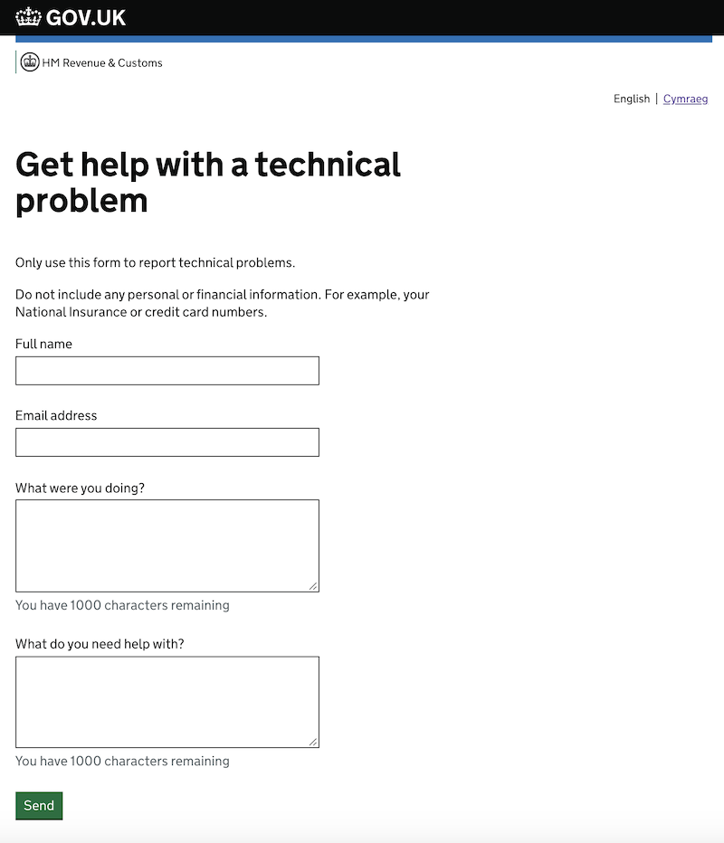
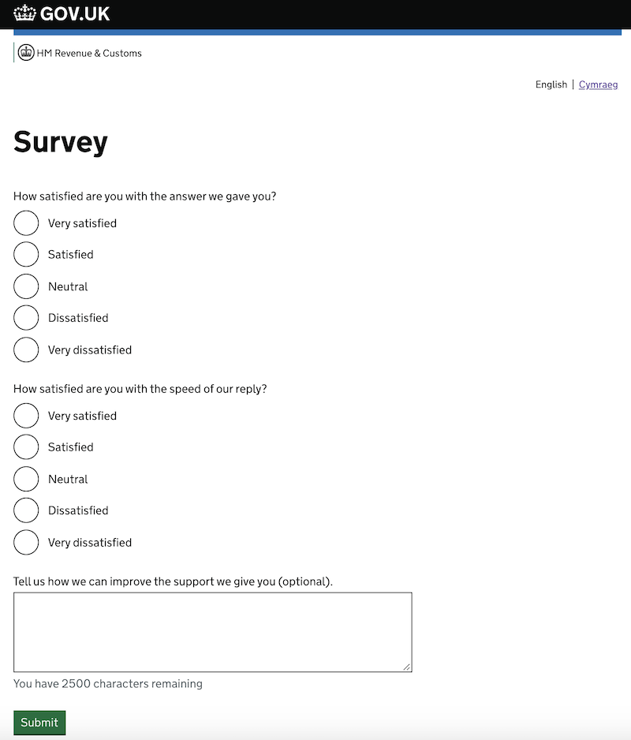

contact-frontend
================

This service allows users to contact the HMRC Customer Contact team for 5 major purposes:
1. reporting technical problems ('Is this page not working properly?')
1. asking questions ('Help and contact')
1. providing feedback on services ('Send your feedback')
1. providing feedback for the HMRC Customer Contact team ('Survey')
1. reporting accessibility problems with services ('Report an accessibility problem')

`contact-frontend` is responsible for hosting forms related to the purposes listed above, validating the input, and
passing user requests to downstream services - to Deskpro for 'Is this page not working properly?', 'Help and contact', 
'Send your feedback' and 'Report an accessibility problem', and an internal auditing service for 'Survey' (contact
 [#team-platui](https://hmrcdigital.slack.com/messages/team-plat-ui/) if you require more information about this).

# Contents
   * [Forms provided by the Customer Contact Subsystem](#forms-provided-by-the-customer-contact-subsystem)
      * [Contacting HMRC - <em>Is this page not working properly?</em>](#contacting-hmrc---get-help-with-this-page)
      * [Contacting HMRC - <em>Help and contact</em>](#contacting-hmrc---help-and-contact)
      * [Providing feedback about Digital Customer Support Team](#providing-feedback-about-digital-customer-support-team)
      * [Providing Beta feedback about services](#providing-beta-feedback-about-services)
      * [Report an accessibility problem](#report-an-accessibility-problem) 
   * [Integration guide](#integration-guide)
      * [Cross-Origin Resource Sharing (CORS)](#cross-origin-resource-sharing-cors)
      * [referer header forwarding to Deskpro](#referer-header-forwarding-to-deskpro)
      * [Creating own customer contact forms](#creating-own-customer-contact-forms)
   * [Other relevant details](#other-relevant-details)
      * [User details attached to the ticket](#user-details-attached-to-the-ticket)
      * [Related projects, useful links](#appendix__linx)
      * [Slack](#appendix__links__slack)

# Forms provided by the Customer Contact Subsystem <a name="forms-provided-by-the-customer-contact-subsystem"></a>

## Contacting HMRC - *Is this page not working properly?* <a name="contacting-hmrc---get-help-with-this-page"></a>

This form provides the primary way for users to report technical issues with tax services. Here is a screenshot of the form:



This contact form consists of the following fields:
- the user's name
- the user's email address
- the action performed by the user
- the error seen by the user

Form submissions are forwarded to *Deskpro* with the subject *"Support Request"*. 
The contents of the *action* and *error* fields are concatenated and stored in the ticket body.

To link to this form, it is recommended that services follow the integration steps detailed in
[play-frontend-hmrc](https://github.com/hmrc/play-frontend-hmrc#helping-users-report-technical-issues). By using the
`play-frontend-hmrc` helper, the required query string parameters `service` and `referrerUrl` will be bound correctly to 
the link. 

The format for the link should be rendered as follows:
* `https://www.{environment}.tax.service.gov.uk/contact/report-technical-problem?service=${serviceId}&referrerUrl=${urlOfPageContainingLink}`

| URL parameter  | Description                                                                                                          |
| ---------------| -------------------------------------------------------------------------------------------------------------------- |
| `service`      | an identifier for your service unlikely to be used by any other service, excluding whitespace and special characters |
| `referrerUrl`  | the full, absolute, properly encoded URL of the page the user was on before they navigated to the contact form       |

### Deprecation notes
Historically, `contact-frontend` supported a version of the form that could be embedded within a service using either a 
server-side partial or injected by Javascript. However, these mechanisms are not supported for services using 
`play-frontend-hmrc` or `play-nunjucks` and are not recommended for reasons of accessibility and usability.

Additionally, `contact-frontend` historically had versions of all standalone pages requiring tax service user login, and
versions not requiring login on endpoints suffixed with "-unauthenticated". The login requirement has now been
deprecated to improve accessibility and usability to all tax service users. 

[[Back to the top]](#top)

## Contacting HMRC - *Help and contact* <a name="contacting-hmrc---help-and-contact"></a>

This form is very similar to the *Is this page not working properly?* form.
There are minor differences in how this form works in comparison to 'Is this page not working properly?'.

This contact form contains only three input fields:
- name
- email address
- comments

Requests of this type are forwarded to *Deskpro* with the subject *"Contact form submission"*

To use this form, render a link on your service to:
* `https://www.{environment}.tax.service.gov.uk/contact/contact-hmrc?service=${serviceId}&referrerUrl=${urlOfPageContainingLink}`

'{environment}.' is not included in the case of the production environment.

| URL parameter  | Description                                                                                                          |
| ---------------| -------------------------------------------------------------------------------------------------------------------- |
| `service`      | an identifier for your service unlikely to be used by any other service, excluding whitespace and special characters |
| `referrerUrl`  | the full, absolute, properly encoded URL of the page the user was on before they navigated to the contact form. For example, a link from the SCP sign in page would look like `https://www.tax.service.gov.uk/contact/contact-hmrc?service=scp&referrerUrl=https%3A%2F%2Fwww.access.service.gov.uk%2Flogin%2Fsignin%2Fcreds` |

### Deprecation notes
`Help and contact` previously also supported embedding itself as a partial; however, this functionality is *deprecated* and should not be used. 

[[Back to the top]](#top)

## Providing feedback about the Digital Customer Support Team ('Customer Satisfaction') <a name="providing-feedback-about-digital-customer-support-team"></a>
Upon resolving a customer issue, response emails are sent by the Digital Customer Support Team containing a link 
inviting users to complete a survey about the customer's satisfaction with the way their issue was handled, this 
survey being provided by contact-frontend.

Here is an example of the email received by the user:


This is how the DCST feedback form looks:



Feedback survey results currently are stored as explicit audit events with the following properties:
* *auditSource* - "frontend"
* *auditType* - "DeskproSurvey"
* *details* 
    * *helpful* - the respose to the question about user satisfaction
    * *speed* - the response about satisfaction with the speed of DCST reply
    * *improve* - contents of the textual field with improvement suggestions
    * *ticketId* - the reference of the case (same as in email)
    * *serviceId* - an identifier of the service - same as provided in the *Is this page not working properly?* page

This functionality is used by Deskpro and shouldn't be used by any consuming service directly.
Emails received from Deskpro should contain link in the following format:

`https://www.{environment}.tax.service.gov.uk/contact/survey?ticketId={deskproTicketKey}&serviceId={serviceId}`

'{environment}.' is not included in the case of the production environment.

This link then redirects the user to the standalone page where the survey can be filled in.

[[Back to the top]](#top)

## Providing Beta feedback about services <a name="providing-beta-feedback-about-services"></a>


This form consists of the following fields:
- service rating (radio button group with 5 values)
- user's name
- user's email address
- additional comments (optional)

Feedback responses are forwarded to Deskpro with the subject *"Beta feedback submission"*

To use this form, render a link on your page to:
* `https://www.{environment}.tax.service.gov.uk/contact/beta-feedback?service=${serviceId}&additional parameters`

'{environment}.' is not included in the case of the production environment.

| URL parameter     | Description                                                                                                          |
| ------------------| -------------------------------------------------------------------------------------------------------------------- |
| `service`         | an identifier for your service unlikely to be used by any other service, excluding whitespace and special characters |
| `canOmitComments` | consuming services can decide whether the 'comments' field is optional. To make this the case, the consuming service must add 'canOmitComments=true' field to the request |
| `backURL`         | an optional 'Back' button redirecting the user back to the consuming service can be embedded into the Beta Feedback form. In order to achieve this, the consuming service has to specify a destination URL |
| `referrerUrl`     | the full, absolute, properly encoded URL of the page the user was on before they navigated to the contact form. For example, a link from the SCP sign in page would look like `https://www.tax.service.gov.uk/contact/beta-feedback?service=scp&referrerUrl=https%3A%2F%2Fwww.access.service.gov.uk%2Flogin%2Fsignin%2Fcreds` |

### Deprecation notes
`Send your feedback` historically also supported displaying the *Send your feedback* page as a partial; however, this
functionality is *deprecated* and should not be used.

[[Back to the top]](#top)

## Report an Accessibility Problem <a name="report-an-accessibility-problem"></a>


This form consists of the following fields:
- Description of accessibility problem
- user's name
- user's email address

Accessibility problems are forwarded to Deskpro with the subject *"Accessibility Problem"*.

This form is linked to from [accessibility-statement-frontend](https://www.github.com/accessibility-statement-frontend)
and is not intended to be used directly.

Services that have not yet migrated to accessibility-statement-frontend display a link that opens a new tab to:
* `https://www.{environment}.tax.service.gov.uk/contact/accessibility?service=${serviceId}&referrerUrl=${referrerUrl}`

`{environment}` is not included in the case of the production environment.

| URL parameter  | Description                                                                                                          |
| ---------------| -------------------------------------------------------------------------------------------------------------------- |
| `service`      | an identifier for your service unlikely to be used by any other service, excluding whitespace and special characters |
| `referrerUrl`  | the full, absolute, properly encoded URL of the page the user was on before they navigated to the contact form       |

[[Back to the top]](#top)

## Cross-Origin Resource Sharing (CORS) <a name="cross-origin-resource-sharing-cors"></a>

When contact forms are embedded on a service's pages, the client's browser communicates with contact-frontend using AJAX requests.
This may cause problems when the service runs on a different domain from the one used by contact-frontend (which is `www.tax.service.gov.uk`). In such a case, the user's browser will block cross-domain AJAX requests, considering them suspicous.

If you want to use contact-frontend in a service that runs on another domain, this can be done by explicitly specifying that other domain in the configuration of contact-frontend. Contact-frontend service will then use [CORS](https://developer.mozilla.org/en-US/docs/Web/HTTP/CORS) (Cross-Origin Resource Sharing) to allow the browser to accept such cross-domain requests.

To achieve that, the service uses the standard  [CORS Filter](https://www.playframework.com/documentation/2.6.x/CorsFilter) provided by Play Framework.
Configuration is defined in `contact-frontend.yaml` within the environment specific `app-config`. Here is example configuration:
```
play.filters.cors.allowedOrigins.0: "https://ewf.companieshouse.gov.uk"
play.filters.cors.allowedOrigins.1: "https://www.{environment}.tax.service.gov.uk"
```

[[Back to the top]](#top)

## referer header forwarding to Deskpro

Historically, `contact-frontend` forwarded the `referer` header to Deskpro when a form was submitted, allowing customer 
service agents to view the page from which an end user navigated to `contact-frontend`. This behaviour is now being
deprecated, and instead the `referrerUrl` should be passed as a query string parameter (see individual page parameters 
above).

[[Back to the top]](#top)

## Creating customized customer contact forms <a name="creating-own-customer-contact-forms"></a>

Currently, it is not possible to customize forms in ways other than described above. If you have business
requirements to customize customer contact form, please get in touch with PlatUI team ([#team-platui](https://hmrcdigital.slack.com/messages/team-plat-ui/))

[[Back to the top]](#top)

# Other relevant information <a name="other-relevant-details"></a>

## User details attached to the ticket <a name="user-details-attached-to-the-ticket"></a>

In addition to the information provided by the user, the service collects the following context data:
* *HTTP Referrer header* - this is the URL of the page on which the user initiated the contact journey, as passed on the
  URL as a query string parameter. Deskpro uses it to classify issues.
* *HTTP UserAgent header* - this tells us what browser the user has
* *user tax identifiers* - if the user has logged in, user tax identifiers will be attached to the tickets. These 
  identifiers can later be seen in Deskpro
* *whether user's browser uses Javascript* 
* *user's id* - as provided in the HeaderCarrier object
* *sessionId* - as provided in the HeaderCarrier object
 
Here is a list of supported identifiers:

* NIN
* UTR
* VAT registration number
* PAYE reference

[[Back to the top]](#top)

## Maintenance documentation
Maintenance documentation for the owning team, including architectural decision records (ADRs) can be found [here](docs/maintainers.md).

## Slack <a name="appendix__links__slack"></a>
* [#team-platui](https://hmrcdigital.slack.com/messages/team-plat-ui/) - PlatUI is responsible for contact-frontend
* [#team-ddcops](https://hmrcdigital.slack.com/messages/team-ddcops) - DDCOps is responsible for Deskpro maintenance

[[Back to the top]](#top)
